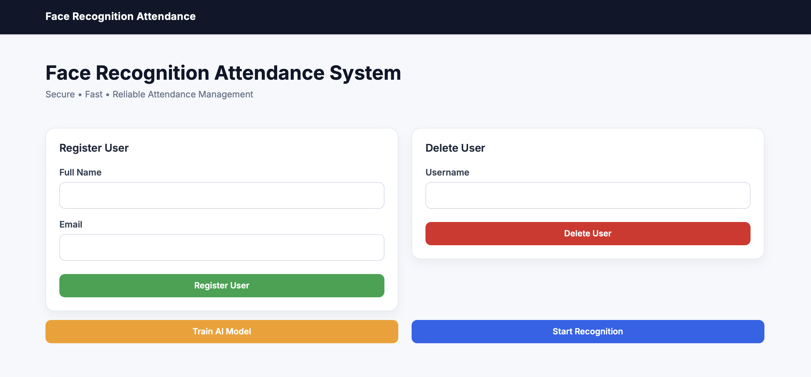
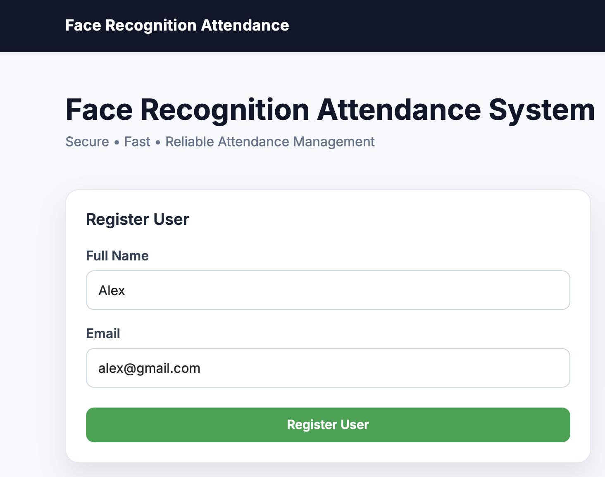
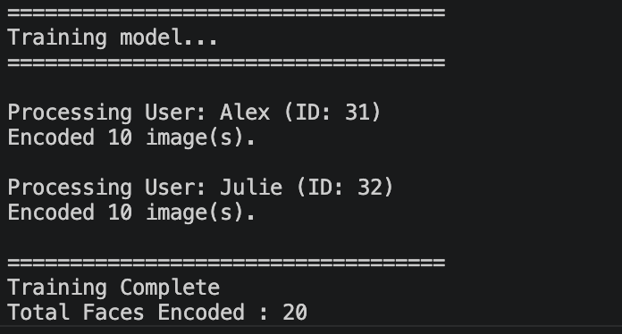
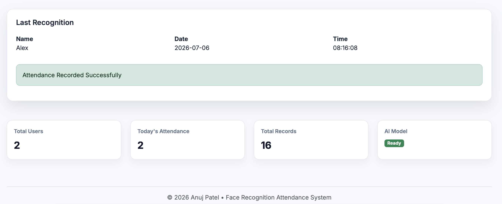
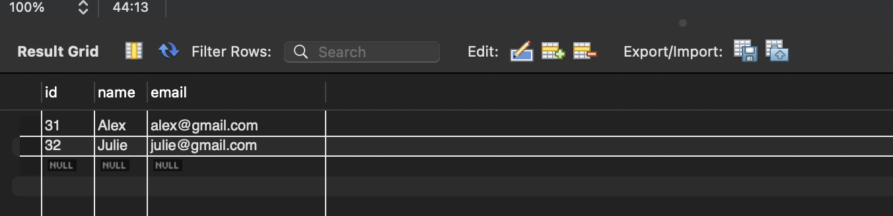

# Face Recognition Attendance System

A web-based face recognition attendance system built using Python, Flask, OpenCV, and MySQL. The application allows users to register, train a face recognition model, and mark attendance automatically through facial recognition.

The project was developed to simplify attendance management by replacing manual attendance with a secure and automated process.

---

## Features

- Register new users through the web interface
- Capture face images using a webcam
- Store user information in MySQL
- Train the face recognition model from registered images
- Recognize registered users in real time
- Automatically record attendance with date and time
- Delete users from both the database and dataset
- View the latest recognized user on the dashboard
- Display dashboard statistics such as:
  - Total registered users
  - Today's attendance
  - Total attendance records
  - Model status

---

## Tech Stack

### Backend
- Python
- Flask

### Computer Vision
- OpenCV
- face_recognition (dlib)

### Database
- MySQL

### Frontend
- HTML
- CSS
- Bootstrap 5
- JavaScript

---

## Project Structure

```
face-recognition-system/
│
├── database/
│   └── db.py
│
├── dataset/
│   ├── 1/
│   ├── 2/
│   └── ...
│
├── models/
│   └── encodings.pickle
│
├── static/
│   ├── css/
│   └── js/
│
├── templates/
│   └── index.html
│
├── app.py
├── register_user.py
├── train_model.py
├── recognize.py
├── requirements.txt
└── README.md
```

---

## Installation

### 1. Clone the repository

```bash
git clone https://github.com/your-username/face-recognition-system.git

cd face-recognition-system
```

---

### 2. Create a virtual environment

#### macOS / Linux

```bash
python3 -m venv venv

source venv/bin/activate
```

#### Windows

```bash
python -m venv venv

venv\Scripts\activate
```

---

### 3. Install dependencies

```bash
pip install -r requirements.txt
```

---

### 4. Create the MySQL database

```sql
CREATE DATABASE face_recognition;
```

Create the required tables:

### Users

```sql
CREATE TABLE users(
    id INT AUTO_INCREMENT PRIMARY KEY,
    name VARCHAR(100),
    email VARCHAR(100)
);
```

### Attendance

```sql
CREATE TABLE attendance(
    id INT AUTO_INCREMENT PRIMARY KEY,
    name VARCHAR(100),
    date DATE,
    time TIME
);
```

---

### 5. Configure database connection

Open:

```
database/db.py
```

Update your MySQL credentials:

```python
host="localhost"
user="root"
password="your_password"
database="face_recognition"
```

---

### 6. Run the application

```bash
python app.py
```

Open your browser:

```
http://127.0.0.1:5000
```

---

## How to Use

### Register a User

Enter the user's name and email, then capture face images using the webcam.

---

### Train the Model

After registering users, click **Train Model** to generate facial encodings.

---

### Start Recognition

Click **Start Recognition** to begin face recognition.

When a registered face is detected:

- The user's name is recognized.
- Attendance is stored automatically in MySQL.
- The latest recognition is displayed on the dashboard.

---

### Delete a User

Enter the username and click **Delete User**.

The application removes:

- User information from the database
- User dataset images

---

### Screenshots

Dashboard

The main dashboard provides an overview of the system, including user registration, user deletion, model training, attendance recognition, and system statistics.



Register User

Users can register by entering their name and email address. The system captures face images through the webcam and stores them in the dataset for future recognition.



Model Training

The training process generates facial encodings from the registered users' dataset and saves them for recognition.



Attendance Recorded

Once a registered user is recognized, the system automatically records attendance and displays the latest recognition details on the dashboard.



Database

The MySQL database stores user information and attendance records, allowing the application to manage registered users and maintain attendance history.



---

## Future Improvements

Some features planned for future versions:

- User management table
- Attendance history page
- Search and filtering
- Export attendance to Excel and PDF
- Live webcam inside the browser
- Attendance analytics dashboard
- Admin login system
- Unknown face detection
- Anti-spoof detection
- Email notifications

---

## Author

**Anuj Patel**

Software Engineering Student

GitHub: https://github.com/Anuj-555

LinkedIn: https://www.linkedin.com/in/anuj-rajesh-patel/

---

## License

This project is licensed under the MIT License. See the LICENSE file for details.

---

If you found this project useful, consider giving it a ⭐ on GitHub.